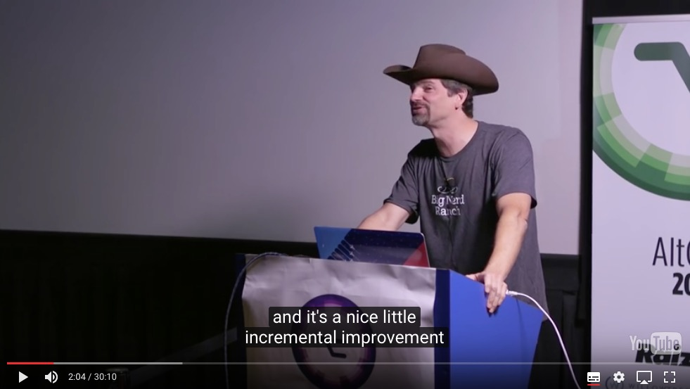
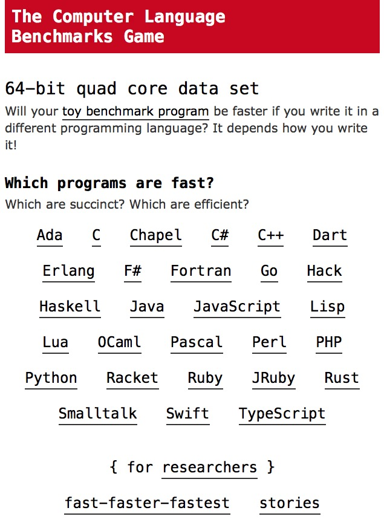
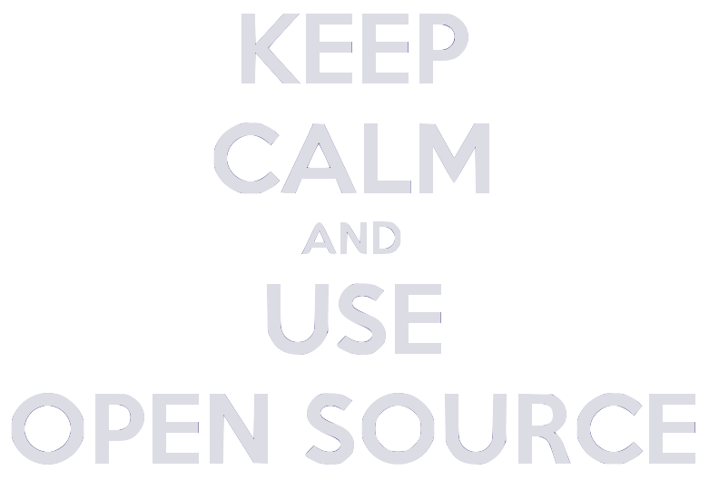
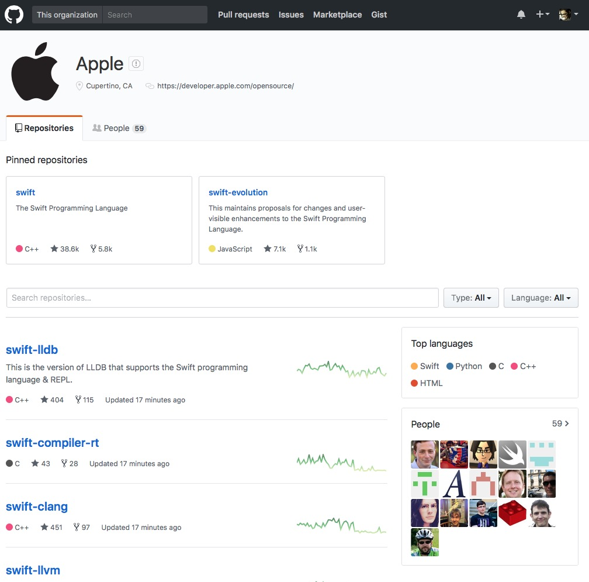

build-lists: true

# Getting started with Swift

---


^
- WWDC 2014: surprise and hype for Swift
- it was the rational thing to do
- Chris Lattner interview: either improve objc or create a new language; no way to make objc safe; ARC exists because of Swift

---



^ 
- cold reception from Objective-C die-hards
- radical departure
- you can use Swift like objc, but the language encourages a different style

---


^ 
- early interest from the functional community
- first class functions, custom operators, value types, easy currying

---


^ 
- anyway, Swift popularity has risen rapidly
- many tradeoffs for supporting objc runtime, but payed

---


^
- the idea of open sourcing it was there from the very beginning
- full history
- typically open sources developer tools (but still not xcode)

---


^ 
- still a lot of discussion, but more powerful features and type system solve a lot of problems better

---

## Unfortunately...

- Standard frameworks are still written in Objective-C, and rely heavily on its runtime
- A lot of development patterns are not *Swifty* at all (delegates, protocols with optional methods, heavy subclassing...)
- `UIViewController`
- Strange runtime errors and crashes

---

## Let's talk language philosophy

# 🤔

---

## Let's talk language philosophy

<br>
> *Swift is friendly to new programmers. It is the first industrial-quality systems programming language that is as expressive and enjoyable as a scripting language.*
-- The Swift programming language 

---

## **Familiarity**

---

## Language Philosophy: **Familiarity**

```swift
var numbers = Array(1..<100)
var found42 = false
for number in numbers {
	if number == 42 {
		found42 = true
	}
}
if found42 {
	print("insert 42 meme here")
}
```

---

## **Safety**

---

## Language Philosophy: **Safety**

```swift
let text = "42"

let maybeFortyTwo = Int(text) /// Int?

//let eightyFour = maybeFortyTwo * 2 /// ERROR

guard let fortyTwo = maybeFortyTwo else {
	/// do something else
	return
}

let eightyFour = fortyTwo * 2 /// Int
```

---

## **Expressiveness**

---

## Language Philosophy: **Expressiveness**

```swift
let toInt: (Character) -> Int = { Int(String($0))! }
let isEven: (Int) -> Bool = { $0 % 2 == 0 }

let sumOfEvens = "0123456789"

	.characters
	
	.map(toInt)

	.filter(isEven)
	
	.reduce(0, +)
```

---

## **Discoverability**

---

## Language Philosophy: **Discoverability**

```swift
enum HTTPCode: Int {
	case OK = 200
	case notFound = 404
	case internalServerError = 500
}

let receivedCode = HTTPCode(rawValue: 404)!
switch receivedCode {
case .OK: print("good job")
default: print("BUUUUUUUG")
}
```

---

## Language Philosophy: **Discoverability**

```swift
enum ConnectionResponse {
	case OK(output: Any)
	case notFound(error: String)
	case internalServerError(error: String)
}

let receivedResponse = ConnectionResponse.notFound(error: "There's nothing here")
switch receivedResponse {
case .notFound(let error): print(error)
case .internalServerError(let error): print(error)
default: print("good job")
}
```

---

## **Speed**

---

## Language Philosophy: **Speed**

> *Swift is intended as a replacement for C-based languages (C, C++, and Objective-C).*
<br>
> *As such, Swift must be comparable to those languages in performance for most tasks.*
<br>
> *Performance must also be predictable and consistent, not just fast in short bursts that require clean-up later.*
<br>
> *There are lots of languages with novel features — being fast is rare.*



^
- http://benchmarksgame.alioth.debian.org

---

## Language Philosophy: **Speed**

Calling C from Swift has almost zero cost


^
- http://lemire.me/blog/2016/09/29/can-swift-code-call-c-code-without-overhead/

---
        
## Features

# 🎨 🎮 🚀 🖥 ⏰ 🎉

---

## Features: **First-Class Functions**

```swift
let tableOf3_0 = (1...10).map({ value in
	return value*3
})
```

---

## Features: **First-Class Functions**

```swift
let tableOf3_1 = (1...10).map { value in
	return value*3
}
```

---

## Features: **First-Class Functions**

```swift
let tableOf3_2 = (1...10).map { $0*3 }
```

---

## Features: **First-Class Functions**

```swift
func times3(value: Int) -> Int {
	return value*3
}

let tableOf3_3 = (1...10).map { times3(value: $0) }
```

---

## Features: **First-Class Functions**

```swift
let tableOf3_4 = (1...10).map(times3)
```

---

## Features: **Value Types**

```swift
struct Point {
	var x: Int
	var y: Int
}
var current = Point(x: 4, y: 2)
let start = current
current.x *= 3
current.y *= 3
let end = current
let vector = Point(x: end.x - start.x, y: end.y - start.y)
/// Point(x: 8, y: 4)
```

---

## Features: **Value Types**

```swift
struct Person {
	var firstName: String
	var lastName: String
	
	func greet(with greeting: String) -> String {
		return "\(greeting) \(firstName) \(lastName)!"
	}
}

let mario = Person(firstName: "Mario", lastName: "Rossi")
print(mario.greet(with: "Da quanto tempo")) /// Da quanto tempo Mario Rossi!
```

---

## Features: **Optionals**

```swift
let maybeEightyFour = maybeFortyTwo.map { $0*2 }

let maybeTrue: Bool? = true

//if maybeTrue { } /// ERROR

if let x = maybeTrue, x == true {
	print("ok great")
}
```

---

## Features: **Optionals**

```swift
struct Company { var name: String }

struct Job { var title: String; var company: Company? }

struct Worker {
	var firstName: String
	var lastName: String
	var job: Job?
}
```

---

## Features: **Optionals**

```swift
let luigi = Worker(
	firstName: "Luigi",
	lastName: "Bianchi",
	job: Job(
		title: "Uomo token",
		company: nil))

let luigisCompanyName = luigi.job?.company?.name /// nil
```

---

## Features: **Initialization**

```swift
/// error: class 'JobRepository' has no initializers
class JobRepository {
	var jobs: [Job]
	
	func add(job: Job) {
		jobs.append(job)
	}
}
```

---

## Features: **Initialization**

```swift
class JobRepository {
	var jobs: [Job]
	
	func add(job: Job) {
		jobs.append(job)
	}
	
	init() {
		jobs = []
	}
}
```

---

## Features: **Extensions**

```swift
extension JobRepository {
	func getJob(withTitle required: String) -> Job? {
		return jobs.first(where: { $0.title == required })
	}
}

let noJob = JobRepository().getJob(withTitle: "Plumber") /// nil
```

---

## Features: **Extensions**

```swift
extension String {
	var reversed: String {
		return String(characters.reversed())
	}
}
```

---

## Features: **Error Handling**

```swift
extension String: Error {}

extension JobRepository {
	func getJob(withTitle required: String) throws -> Job {
		if let first = jobs.first(where: { $0.title == required }) {
			return first
		} else {
			throw "No job with title: \(required)"
		}
	}
}

/// error: call can throw but is not marked with 'try'
let noJob = JobRepository().getJob(withTitle: "Plumber")
```

---

## Features: **Error Handling**

```swift
do {
	let noJob = try JobRepository().getJob(withTitle: "Plumber")
	print("JOB FOUND")
}
catch let error {
	print(error) /// No job with title: Plumber
}
```

---

## Features: **Protocols**

```swift
class Page {}

enum PresentationStyle {
	case push
	case modal
}

protocol PagePresenter {
	func present(page: Page, style: PresentationStyle)
}
```

---

## Features: **Protocols**

```swift
class AppNavigator: PagePresenter {
	func present(page: Page, style: PresentationStyle) {
		/// presentation code
	}
}

extension Page {
	func presentModally(with presenter: PagePresenter) {
		presenter.present(page: self, style: .modal)
	}
}
```

---

## Features: **Protocols**

```swift
extension PagePresenter {
	func presentModally(_ page: Page) {
		present(page: page, style: .modal)
	}
}

protocol PageOwner: PagePresenter {
	var page: Page { get }
}

extension PageOwner {
	func presentModally() {
		present(page: page, style: .modal)
	}
}
```

---

## Features: **Protocols**

```swift
protocol PagePresenter {
	func present(page: Page, style: PresentationStyle)
}

protocol PageOwner {
	var page: Page { get }
}

extension PageOwner where Self: PagePresenter {
	func presentModally() {
		present(page: page, style: .modal)
	}
}
```

---

## Features: **Generics**

```swift
struct Resource<A> {
	let name: String
	let parse: (Any) -> A?
}

let id = Resource<Int>(name: "Identifier") {
	guard let value = $0 as? Int, value > 0 else { return nil }
	return value
}
```

---

## Features: **Generics**

```swift
let possibleIds: [Any] = ["notAnId", 1, 2, 0, -1, "5", 6]

let actualIds = possibleIds.flatMap(id.parse)

print(actualIds) // [1,2,6]
```

---

## Features: **Testing**

```swift
extension Int {
	func modulo(_ value: Int) -> Int {
		return self % value
	}
}

func testModulo() {
	XCTAssertEqual(3.modulo(2), 1)
}

testModulo()
```

---

## Features: **Testing**

- XCTest is powerful but rudimentary.
- Hard to write *declarative* test cases.
- There are many excellent testing frameworks.
- I like **Quick**, a BDD framework.
- It comes with **Nimble**, a matcher framework that's much nicer to use than XCTest.

---

## Features: **Playgrounds**

- Advanced REPL
- View rendering
- Value history
- Can be added to Xcode projects, to test your code dynamically
- Also on iPad

---

## Features: **Objective-C Interoperability**

- Swift can natively work with Objective-C code and can interact with Objective-C runtime
- Objective-C can only see a *subset* of Swift
- Objective-C is not compatible with *struct* and *enum*
- Swift classes must be subclasses of NSObject
- Either you write Swift *like* Objective-C...
- ...or you write *adapters* that turn Swift code into something visible to Objective-C

---



---



---

## Open Source

- swift.org
- apple/swift
- apple/swift-evolution
- apple/swift-package-manager
- apple/swift-corelibs-foundation
- apple/swift-corelibs-libdispatch

---
[.build-lists: false]
## Open Source

- mailing lists
- bugs.swift.org (Jira)


---


---


---

## Linux

# 

---

## Linux

- At the same time when Swift was open sourced, it was also released for Linux.
- Initial raw support, but has grown a lot since then.
- Swift Package Manager has been fully developed, and has gone through a lot of proposals.
- Official docker image: [https://hub.docker.com/r/_/swift/](https://hub.docker.com/r/_/swift/)
- XCTest is shipped with Swift: just run `swift test`
- The Server APIs Project

^
- the docker image is maintained by non-apple people, with swift team approval
- Quick is compatible with Linux and Swift Package Manager.

---

## Swift Package Manager

- Bundled with Swift.
- Uses Swift as language to describe dependencies.
- Can generate Xcode project in macOS.
- Only builds on host platforms (thus, no iOS)
- Not currently compatible with Xcode projects for apps.

^ 
- a lot is being done on the github repository
- announcements for xcode 9?

---

## Swift Package Manager

```
mkdir MyPackage
cd MyPackage
swift package init # or swift package init --type library
# will create 'Sources' and 'Tests' folders
# will create a 'Package.swift' file
swift build
swift test
```

---

## Swift Package Manager

```swift
import PackageDescription

let urlString = "https://github.com/apple/example-package-playingcard.git"

let package = Package(
    name: "MyPackage",
    dependencies: [
        .Package(url: urlString, majorVersion: 3),
    ]
)

/// Dependencies will go in a 'Packages' folder
```

---

## Resources

### Websites and Apps
- [swift.org](https://swift.org)
- [apple.github.io/swift-evolution/](https://apple.github.io/swift-evolution/)
- [Evolution App](https://itunes.apple.com/us/app/evolution-app/id1210898168?mt=8)
- [theswiftwebdeveloper.com](https://theswiftwebdeveloper.com)

---

## Resources

### Mailing Lists
- [swiftweekly.com](http://swiftweekly.com)
- [swiftweekly.github.io](https://swiftweekly.github.io)

---

## Resources

### Podcasts
- Swift Unwrapped
- Swift Coders

---

# Thank You

[https://joind.in/talk/ed577](https://joind.in/talk/ed577)

[https://github.com/broomburgo/Getting-started-with-Swift](https://github.com/broomburgo/Getting-started-with-Swift)
